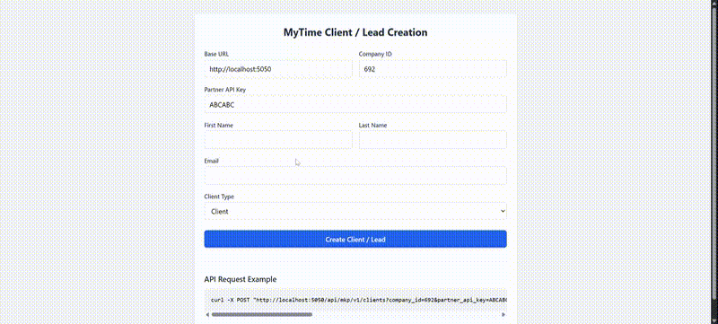

# MyTime Client/Lead Creation Application

This directory contains an example application demonstrating how to integrate with MyTime's Public API to create clients or leads. The application allows users to submit client/lead information to the MyTime system using the API.

## Demo



[Download Full Video](./client_lead_creation.webm)

## Overview

The example application in `index.html` demonstrates a client/lead creation flow with the following features:

1. Form for submitting client/lead information
2. Support for URL parameters to pre-fill API credentials
3. Dropdown selection for client type (Client or Lead)
4. Detailed error handling and display
5. Success response display with client information
6. Live-updating curl command example

## Technologies Used

- **React**: For building the user interface
- **Axios**: For making API calls to MyTime's Public API
- **Tailwind CSS**: For styling the application with minimal custom CSS

## How to Build a Similar Application

### 1. Set Up Your Project

Start with a basic HTML structure that includes the necessary dependencies:

```html
<!DOCTYPE html>
<html lang="en">
<head>
    <meta charset="UTF-8">
    <meta name="viewport" content="width=device-width, initial-scale=1.0">
    <title>MyTime Lead Creation</title>
    <script src="https://cdn.tailwindcss.com"></script>
    <script src="https://unpkg.com/react@18/umd/react.development.js"></script>
    <script src="https://unpkg.com/react-dom@18/umd/react-dom.development.js"></script>
    <script src="https://unpkg.com/axios/dist/axios.min.js"></script>
    <script src="https://unpkg.com/@babel/standalone/babel.min.js"></script>
</head>
<body class="bg-gray-100">
    <div id="root"></div>
    <!-- Your React code will go here -->
</body>
</html>
```

### 2. Create the React Application Structure

Set up your React application with the necessary state variables to track:

- Form data (base URL, company ID, partner API key, client information)
- API response
- Error state
- Loading state

### 3. Implement URL Parameter Handling

Add functionality to read URL parameters to pre-fill form fields:

```javascript
const getUrlParam = (param) => {
    const urlParams = new URLSearchParams(window.location.search);
    return urlParams.get(param);
};

const [formData, setFormData] = useState({
    baseUrl: getUrlParam('base_url') || 'http://localhost:3000',
    companyId: getUrlParam('company_id') || '',
    partnerApiKey: getUrlParam('partner_api_key') || '',
    firstName: '',
    lastName: '',
    email: '',
    clientType: 'MyClient::Client'
});
```

### 4. Implement the Form Submission Logic

Create a function to handle form submission and make the API call:

```javascript
const handleSubmit = async (e) => {
    e.preventDefault();
    setLoading(true);
    setError(null);
    setResponse(null);
    
    try {
        const url = `${formData.baseUrl}/api/mkp/v1/clients?company_id=${formData.companyId}&partner_api_key=${formData.partnerApiKey}&client_type=${formData.clientType}`;
        
        const payload = {
            client: {
                first_name: formData.firstName,
                last_name: formData.lastName,
                email: formData.email
            }
        };
        
        const result = await axios.post(url, payload, {
            headers: {
                'Content-Type': 'application/json',
                'Accept': 'application/json'
            }
        });
        
        setResponse(result.data);
    } catch (err) {
        if (err.response && err.response.data) {
            setError(err.response.data);
        } else {
            setError({ message: err.message || 'An error occurred' });
        }
    } finally {
        setLoading(false);
    }
};
```

### 5. Implement Error Handling

Create a function to handle and display various error formats from the API:

```javascript
const renderErrorMessage = (errorObj) => {
    if (!errorObj) return null;
    
    if (typeof errorObj === 'string') {
        return <p>{errorObj}</p>;
    }
    
    if (errorObj.errors) {
        return (
            <ul className="list-disc pl-5 space-y-2">
                {Object.entries(errorObj.errors).map(([key, messages]) => {
                    // Handle array of objects with type and info properties
                    if (Array.isArray(messages) && messages.length > 0 && typeof messages[0] === 'object') {
                        return (
                            <li key={key} className="mb-2">
                                <div className="font-medium capitalize">{key}:</div>
                                <ul className="list-disc pl-5 mt-1">
                                    {messages.map((msg, idx) => (
                                        <li key={idx} className="text-sm">
                                            {msg.type && <span className="font-medium">Type: </span>}
                                            {msg.type && <span className="capitalize">{msg.type}</span>}
                                            {msg.info && <span className="block mt-1 text-xs">{msg.info}</span>}
                                        </li>
                                    ))}
                                </ul>
                            </li>
                        );
                    }
                    
                    // Handle string or array of strings
                    return (
                        <li key={key} className="mb-1">
                            <span className="font-medium capitalize">{key}: </span>
                            <span>{Array.isArray(messages) ? messages.join(', ') : messages}</span>
                        </li>
                    );
                })}
            </ul>
        );
    }
    
    return <p>{errorObj.message || JSON.stringify(errorObj)}</p>;
};
```

### 6. Build the User Interface

Create a responsive UI using Tailwind CSS with components for:

- Form inputs for API credentials (base URL, company ID, partner API key)
- Form inputs for client information (first name, last name, email)
- Client type dropdown (Client or Lead)
- Submit button with loading state
- Error display section
- Success response display
- API request example (curl command)

### 7. Display the API Response

Create a component to display the successful API response:

```jsx
{response && (
    <div className="mt-6 p-4 bg-green-50 border border-green-200 rounded-md">
        <h3 className="text-lg font-medium text-green-800 mb-2">Lead Created Successfully</h3>
        
        {response.client && (
            <div className="space-y-4">
                <div className="grid grid-cols-1 md:grid-cols-2 gap-4">
                    <div className="bg-white p-3 rounded shadow-sm">
                        <h4 className="font-medium text-gray-800 mb-2">Client Information</h4>
                        <div className="space-y-1">
                            <p><span className="font-medium">ID:</span> {response.client.id}</p>
                            <p><span className="font-medium">Name:</span> {response.client.first_name} {response.client.last_name}</p>
                            <p><span className="font-medium">Email:</span> {response.client.email}</p>
                            <p><span className="font-medium">Type:</span> {response.client.type}</p>
                        </div>
                    </div>
                    
                    {/* Additional client information */}
                </div>
            </div>
        )}
        
        <details className="mt-4">
            <summary className="cursor-pointer text-sm text-gray-600 hover:text-gray-800">View Raw Response</summary>
            <pre className="mt-2 text-xs text-gray-700 whitespace-pre-wrap bg-gray-50 p-2 rounded">
                {JSON.stringify(response, null, 2)}
            </pre>
        </details>
    </div>
)}
```

### 8. Add a Live-Updating API Example

Include a section that shows a live-updating curl command example:

```jsx
<div className="mt-8 border-t pt-6">
    <h3 className="text-lg font-medium text-gray-800 mb-2">API Request Example</h3>
    <pre className="bg-gray-100 p-4 rounded-md text-sm overflow-x-auto">
        {`curl -X POST "${formData.baseUrl}/api/mkp/v1/clients?company_id=${formData.companyId}&partner_api_key=${formData.partnerApiKey}&client_type=${formData.clientType}" \\
  -H "accept: application/json" \\
  -H "Content-Type: application/json" \\
  -d "{ \\"client\\": { \\"first_name\\": \\"${formData.firstName}\\", \\"last_name\\": \\"${formData.lastName}\\", \\"email\\": \\"${formData.email}\\" }}"`}
    </pre>
</div>
```

## API Endpoint Used

| Endpoint | Method | Description |
|----------|--------|-------------|
| `/api/mkp/v1/clients` | POST | Create a new client or lead |

### Query Parameters

| Parameter | Description |
|-----------|-------------|
| `company_id` | The ID of the company to create the client/lead for |
| `partner_api_key` | The partner API key for authentication |
| `client_type` | The type of client to create (MyClient::Client or MyClient::Lead) |

### Request Body

```json
{
  "client": {
    "first_name": "John",
    "last_name": "Doe",
    "email": "john.doe@example.com"
  }
}
```

## Testing the Application

To test the application:

1. Open the `index.html` file in a web browser
2. Provide the base URL, company ID, and partner API key (or pass them as URL parameters)
3. Fill in the client information (first name, last name, email)
4. Select the client type (Client or Lead)
5. Submit the form to create the client/lead

## URL Parameters

The application supports the following URL parameters:

- `base_url`: The base URL for the MyTime API
- `company_id`: The ID of the company to create the client/lead for
- `partner_api_key`: The partner API key for authentication (see security note below)

Example: `index.html?base_url=https://www.mytime.com&company_id=12345`

## Security Considerations

### Protecting the Partner API Key

**IMPORTANT:** The partner API key should never be exposed in your frontend code. Including it directly in your JavaScript or as a URL parameter poses a serious security risk as it could be extracted and misused by malicious actors.

#### Recommended Implementation

1. **Create a Backend API Endpoint**
   - Develop a secure backend service/API that will act as an intermediary between your frontend and the MyTime API
   - Store your partner API key securely on your backend (e.g., in environment variables or a secure key management system)

2. **Backend Implementation**
   - Your backend should receive requests from your frontend application
   - Use the securely stored partner API key to make the client creation API call to MyTime
   - Return only the necessary data to your frontend

   ```javascript
   // Example backend code (Node.js/Express)
   app.post('/api/create-client', async (req, res) => {
     try {
       const { baseUrl, companyId, clientData, clientType } = req.body;
       
       // Partner API key stored securely in environment variables
       const partnerApiKey = process.env.MYTIME_PARTNER_API_KEY;
       
       const response = await axios.post(
         `${baseUrl}/api/mkp/v1/clients?company_id=${companyId}&partner_api_key=${partnerApiKey}&client_type=${clientType}`,
         { client: clientData },
         {
           headers: {
             'Content-Type': 'application/json',
             'Accept': 'application/json'
           }
         }
       );
       
       // Return only the necessary data to the frontend
       res.json(response.data);
     } catch (error) {
       res.status(error.response?.status || 500).json(error.response?.data || { message: 'Failed to create client' });
     }
   });
   ```

3. **Frontend Implementation**
   - Your frontend should call your secure backend API instead of directly calling the MyTime API with the partner API key
   
   ```javascript
   // Instead of this (insecure):
   const url = `${formData.baseUrl}/api/mkp/v1/clients?company_id=${formData.companyId}&partner_api_key=${formData.partnerApiKey}&client_type=${formData.clientType}`;
   const result = await axios.post(url, { client: clientData });
   
   // Do this (secure):
   const result = await axios.post('/api/create-client', {
     baseUrl: formData.baseUrl,
     companyId: formData.companyId,
     clientData: {
       first_name: formData.firstName,
       last_name: formData.lastName,
       email: formData.email
     },
     clientType: formData.clientType
   });
   ```

4. **Additional Security Measures**
   - Implement proper authentication on your backend API to prevent unauthorized access
   - Consider using CSRF protection for your API endpoints
   - Implement rate limiting to prevent abuse
   - Consider using reCAPTCHA or similar services to prevent automated attacks
   - Use HTTPS for all communications

## Best Practices

1. Always handle API errors gracefully and display user-friendly error messages
2. Validate user inputs before making API calls
3. Provide clear feedback to users about the success or failure of their actions
4. Include helpful examples of API usage
5. Use responsive design for better mobile experience
6. Implement proper error handling for all API calls
